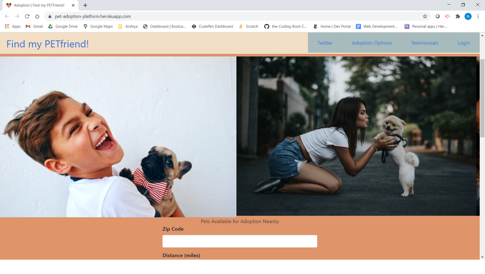

# About the Project

This is a complete **FULL-STACK APPLICATION** about **PET FINDER/ADOPTION**.
In this application, user can login with google and explore the application and post comments as well.If the user is not logged in , can't see the previous comments and not be able to do the search for pets and post comments. When user, post the comments, it shows in the database that who posted the comments details.

# TABLE-CONTENTS
[USER-STORY](#USER-STORY)

[DESCRIPTION](#DESCRIPTION)

[GOOGLE-OAUTH2-LOGIN-AUTHENTICATION](#GOOGLE-OAUTH2-LOGIN-AUTHENTICATION)

[NPM-PACKAGES-USED-IN-NODE-AUTHENTICATION](#NPM-PACKAGES-USED-IN-NODE-AUTHENTICATION)

[RESOURCES-REFERRED](#RESOURCES-REFERRED)

[TEXT-EDITOR](#TEXT-EDITOR)

[PROGRAMMING-LANGUAGES-USED](#PROGRAMMING-LANGUAGES-USED)

[GIT-HUB-REPOSITORY](#GIT-HUB-REPOSITORY)

[HEROKU-DEPLOYED-LINK](#HEROKU-DEPLOYED-LINK)

[SCREEN-SHOTS](#SCREEN-SHOTS)

# USER-STORY

As a user, checkout the application 

As a user, if intrested in posting comments ,

and do the search for pets ,
user have to login with google.

# DESCRIPTION

In this **application** our **FILE-STRUCTURE** is based
on **MVC:MODELS VIEWS CONTROLLERS** .The
main function of **MVC** is easy to understand the file structure, easy to 
figure out where the **ERROR** is and where to go and fix it .By dividing applicationinto three logical parts, it's very easy for the **USERS** and 
other **DEVELOPERS** have a smooth walkthrough of code.

## GOOGLE-OAUTH2-LOGIN-AUTHENTICATION
It is the process of recognizing the user's identity or to identify the user 
at the computer when logged in.

## NPM-PACKAGES-USED-IN-NODE-AUTHENTICATION:-
 **Passport** :-Passport is Express-compatible authentication middleware for Node.js.Passport's main motive is to authenticate requests, which it does through   plugins known as strategies. We must provide Passport a request to authenticate, and it provides hooks for controlling what occurs when authentication is successfull or it fails. **Strategies** are used to authenticate requests. They should be  configured before authenticating requests.

 **passport-google-OAuth2**:-It lets you authenticate using Google in your Node.js applications.The Google OAuth 2.0 authentication strategy authenticates users using a **Google account** . The strategy requires a verify **callback**, which accepts these **credentials** and calls done providing a user, as well as options specifying a **client ID, client secret, and callback URL**.We have to access
 **GOOGLE DEVELOPER CONSOLE** in order to get **Id,SECRET and CALLBACK URL**.

 **express**:-In order to get express , it's important to install NODE.js and then express .It provides a small but fast tool for HTTP servers, making it a good answer for single page applications, web sites, hybrids, or public HTTP APIs. 

 **DOTENV**:-It  is a zero-dependency module that loads environment variables from a .env file into process.env. And it stores the configuration in the environment separate from code .

 **Sequelize**:-It is a promise-based ORM for Node. js . It supports the dialects of  MySQL and holds strong foundation support, relations and more.

 
 **COOKIE-SESSION**:-It is a simple cookie-based session middleware.
A user session can be stored in two main ways with cookies: on the server or on the client. This module stores the session data on the client within a cookie.

# RESOURCES-REFERRED
[NPM-DOCUMENTATION](https://www.npmjs.com/package/express)

[NPM-PASSPORT](https://www.npmjs.com/package/passport)

[PASSPORT-GOOGLE-OAUTH](https://www.npmjs.com/package/passport-google-oauth2)

[COOKIE-SESSION](https://www.npmjs.com/package/cookie-session)

[GOOGLE-DEVELOPER-CONSOLE](https://developers.google.com/web/tools/chrome-devtools/open)

[BULMA](https://bulma.io/)

[PURE-CSS](https://purecss.io/)

[VIDEO-TUTORIAL-GOOGLEOAUTH](https://www.youtube.com/watch?v=9x66l93iEW0)

# TEXT-EDITOR

**Vs-Code**
# PROGRAMMING-LANGUAGES-USED
**HTML**

**JAVASCRIPT**

**CSS**

**JQUERY**

# GIT-HUB-REPOSITORY
# [GIT-HUB-REPOSITORY](https://github.com/priteshpatel823/project_2)

# HEROKU-DEPLOYED-LINK
# [HEROKU-LINK](https://pet-adoption-platform.herokuapp.com/)

# SCREEN-SHOTS

# VIDEO-DEMO
[VIDEO-DEMO](https://utaausfsfpt10-bqo9074.slack.com/files/U01BM4Z7HFF/F01LQBEH59Q/screen_recording_2021-02-02_at_10.49.29_am.mov?origin_team=T01B5QPJR45&origin_channel=G01LBQQ66RW)